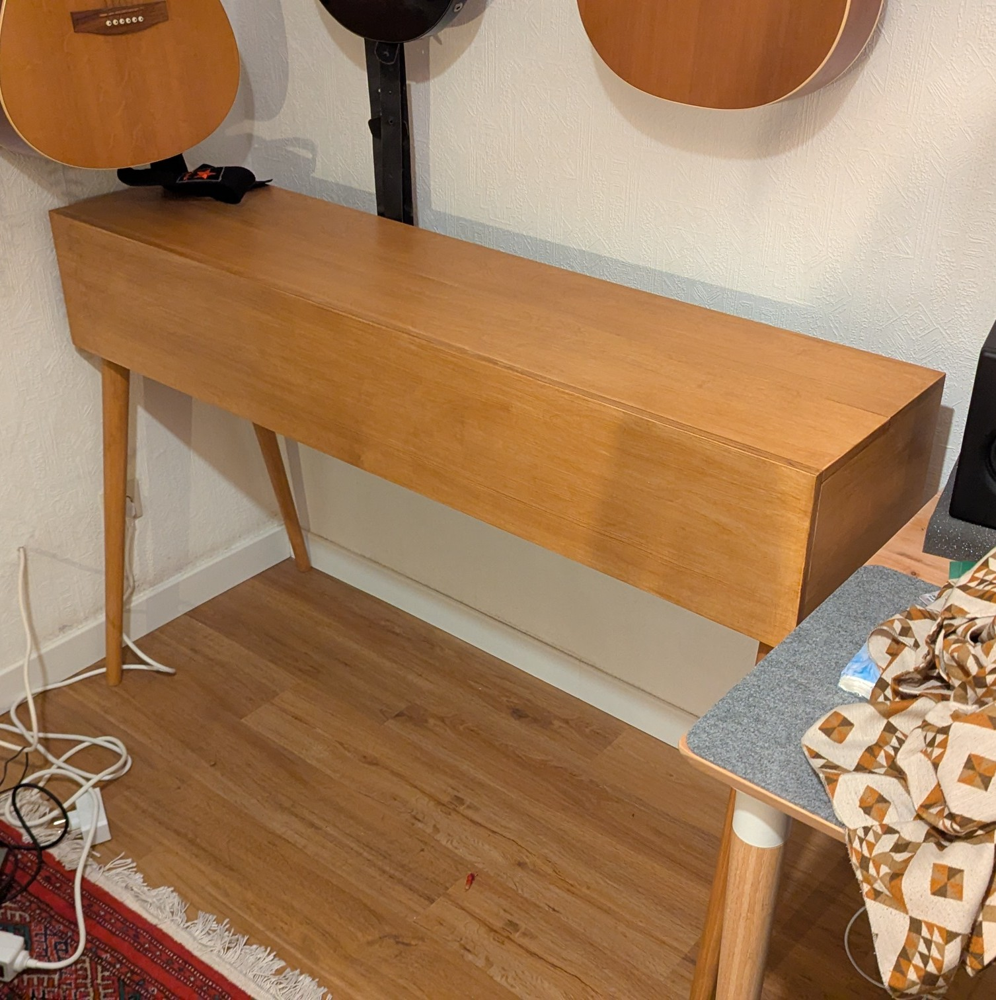

# Piano-Keyboard-Stand-with-Case
CAD Design of Stand for Keyboards and Stage Pianos that can be fully closed.

Project files are available for OpenCAD, a free and open CAD software, so anyone can use the files. The dimensions of the case are read from a spreadsheet included in the file. Just change the dimensions to the ones of your Piano and the final design will perfectly fit yours.
If you dont want to change the case dimensions to your needs, use the default measurements in *default_size_drawings". They fit perfectly for a Yamaha P-145 B, a 88 key stage piano.

The design does not include legs. You can find suitable wooden legs online. Just screw them to the bottom of the case. I recommend wooden legs that can be shortened or adjustable ones, as standard tbale legs might be too long.
